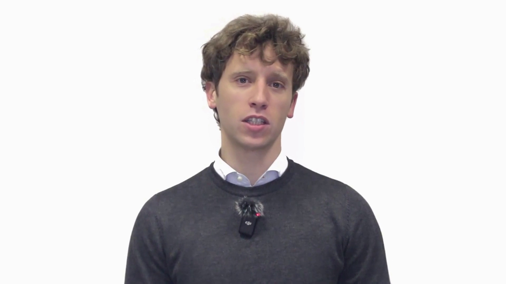
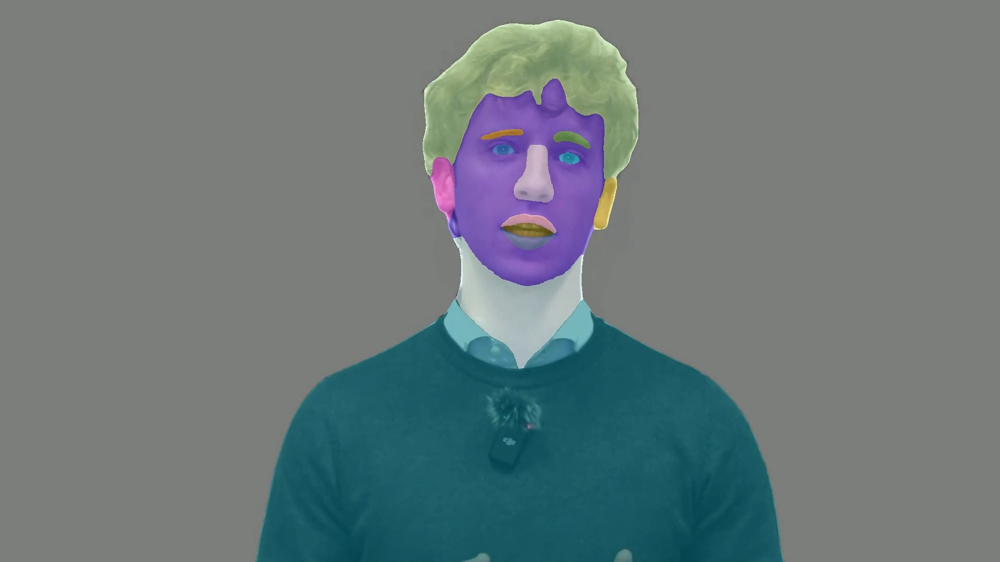

<div align="center">

# Video Face Analysis

**Two-stage semantic segmentation pipeline for face and person parsing in video streams**

[](https://www.python.org/)
[](https://pytorch.org/)
[](https://developer.nvidia.com/cuda-toolkit)
[](https://opencv.org/)
[](https://riverbankcomputing.com/software/pyqt/)
[](LICENSE)

</div>

---

## Overview

This project implements a robust pipeline for the semantic segmentation of human subjects in video, combining **Segment Anything (SAM)** for coarse region separation (background, body, face, hair) and **BiSeNet** for fine-grained face parsing across 15 facial classes (eyebrows, eyes, nose, lips, ears, neck, and related structures).

A dedicated post-processing layer enforces **anatomical constraints** to correct common parsing errors, such as left/right side inversions relative to the nose axis or swapped upper/lower lip regions. A spatial validation step ensures that face and hair masks are coherently positioned with respect to the body mask.

---

## Demo

<div align="center">
<table>
<tr>
<td align="center"><b>Original frame</b></td>
<td align="center"><b>Segmentation overlay (19 classes)</b></td>
</tr>
<tr>
<td></td>
<td></td>
</tr>
</table>
</div>

---

## Key features

- **Hybrid SAM + BiSeNet pipeline** &mdash; robust coarse segmentation combined with detailed face parsing.
- **Dual SAM inference modes** &mdash; `Generator` (high accuracy, per-frame) or `Generator + Predictor` (significantly faster, reuses bounding boxes across intermediate frames).
- **Spatial validation** &mdash; automatic bidirectional swap when face or hair masks are detected below the body region.
- **Anatomical mask corrector** &mdash; resolves inverted eyebrows, eyes and ears with respect to the nose centroid; corrects upper/lower lip swaps; absorbs spurious blobs into the background based on perimeter contact ratio.
- **PyQt5 GUI and CLI** &mdash; graphical interface with real-time logging, or terminal-based execution.
- **Multiple output formats** &mdash; annotated MP4 video, CSV with per-blob statistics, and compressed NPZ archive containing all per-frame masks.
- **GPU optimizations** &mdash; FP16 inference, cuDNN benchmark, automatic mixed precision, and periodic memory management.

---

## Pipeline architecture

```
   ┌──────────────┐
   │  Input video │
   └──────┬───────┘
          │ frame extraction
          ▼
   ┌──────────────────────┐    ┌─────────────────────────┐
   │  SAM (ViT-H)         │───▶│ Overlap filtering and   │
   │  Automatic Generator │    │ gap-filling expansion   │
   └──────────────────────┘    └────────────┬────────────┘
                                            │
                                            ▼
                              ┌──────────────────────────┐
                              │  Spatial validation      │
                              │  (face/hair above body)  │
                              └────────────┬─────────────┘
                                           │
                                           ▼
                              ┌──────────────────────────┐
                              │  Face bbox extraction    │
                              │  (circularity criterion) │
                              └────────────┬─────────────┘
                                           │
                                           ▼
                              ┌──────────────────────────┐
                              │  BiSeNet face parsing    │
                              │  (15 facial classes)     │
                              └────────────┬─────────────┘
                                           │
                                           ▼
                              ┌──────────────────────────┐
                              │  Anatomical corrector    │
                              │  (constraint enforcement)│
                              └────────────┬─────────────┘
                                           │
                                           ▼
                              ┌──────────────────────────┐
                              │  Video + CSV + NPZ       │
                              └──────────────────────────┘
```

---

## Repository structure

```
video-face-segmentation/
├── main.py                      Entry point (GUI and CLI)
├── config.py                    Centralized configuration parameters
├── requirements.txt
├── README.md
├── LICENSE
│
├── Core/
│   ├── segmentation.py          SAM Generator and Predictor logic, post-processing
│   ├── face_parsing.py          BiSeNet integration with SAM masks
│   └── video_processor.py       Frame extraction and video reconstruction
│
├── Gui/
│   └── main_window.py           PyQt5 user interface
│
├── Utils/
│   ├── mask_utils.py            Colormap and blending utilities
│   ├── mask_corrector.py        Anatomical post-parsing corrections
│   ├── mask_saver.py            Streaming NPZ persistence
│   └── csv_writer.py            Per-blob CSV statistics writer
│
├── assets/                      Documentation images
│
└── (external dependencies, not tracked by git)
    ├── segment-anything-main/   SAM repository and weights
    └── face-parsing-main/       BiSeNet repository and weights
```

---

## Installation

### 1. Clone the repository

```bash
git clone https://github.com/<your-username>/video-face-segmentation.git
cd video-face-segmentation
```

### 2. Create a virtual environment

```bash
python -m venv .venv

# Windows
.venv\Scripts\activate

# Linux / macOS
source .venv/bin/activate
```

### 3. Install PyTorch with CUDA

Select the appropriate build for your CUDA version from [pytorch.org](https://pytorch.org/get-started/locally/). Example for CUDA 11.8:

```bash
pip install torch torchvision --index-url https://download.pytorch.org/whl/cu118
```

### 4. Install remaining dependencies

```bash
pip install -r requirements.txt
```

### 5. Install Segment Anything (SAM)

From the project root:

```bash
git clone https://github.com/facebookresearch/segment-anything.git segment-anything-main
cd segment-anything-main
pip install -e .
cd ..
```

Download the ViT-H checkpoint (approximately 2.4 GB) into `segment-anything-main/`:

```bash
# Linux / macOS
wget -P segment-anything-main https://dl.fbaipublicfiles.com/segment_anything/sam_vit_h_4b8939.pth
```

On Windows, download the file from the link above and save it as `segment-anything-main/sam_vit_h_4b8939.pth`.

### 6. Install the BiSeNet face-parsing repository

```bash
git clone https://github.com/yakhyo/face-parsing.git face-parsing-main
```

Download the `resnet34.pt` checkpoint from the repository releases page and place it under `face-parsing-main/weights/resnet34.pt`.

### 7. Verify configuration paths

Open `config.py` and confirm that the checkpoint paths point to the correct files:

```python
SAM_CHECKPOINT     = ".../segment-anything-main/sam_vit_h_4b8939.pth"
BISENET_CHECKPOINT = ".../face-parsing-main/weights/resnet34.pt"
```

---

## Usage

### GUI mode

```bash
python main.py
```

The interface allows selecting an input video, toggling the Predictor mode for higher throughput, and starting the analysis. Real-time logging reports the processing state of each frame.

### CLI mode

```bash
# Generator only (highest accuracy)
python main.py path/to/video.mp4

# Generator + Predictor (faster, predictor on intermediate frames)
python main.py path/to/video.mp4 true
```

---

## Output

Upon completion, the following artifacts are produced under `outputs/`:

| File | Description |
|---|---|
| `<video>_segmented.mp4` | Video with colored mask overlay |
| `analysis_csv/<video>_analysis.csv` | Per-frame, per-blob statistics: area, bounding box, centroid, class label |
| `masks_data/<video>_masks.npz` | Compressed archive of all per-frame masks (`uint8`, H&times;W) |

Mask reloading example:

```python
from Utils.mask_saver import MaskSaver

masks = MaskSaver.load_masks("outputs/masks_data/video_masks.npz")
mask_frame_42 = masks[42]   # numpy array (H, W) with class ID per pixel
```

---

## Class definitions

| ID  | Name      | Description        | ID  | Name      | Description     |
|-----|-----------|--------------------|-----|-----------|-----------------|
| 1   | skin      | Facial skin        | 11  | mouth     | Inner mouth     |
| 2   | l_brow    | Left eyebrow       | 12  | u_lip     | Upper lip       |
| 3   | r_brow    | Right eyebrow      | 13  | l_lip     | Lower lip       |
| 4   | l_eye     | Left eye           | 14  | neck      | Neck            |
| 5   | r_eye     | Right eye          | 15  | neck_l    | Necklace        |
| 6   | eye_g     | Eyeglasses         | 16  | hair      | Hair            |
| 7   | l_ear     | Left ear           | 17  | body      | Body / clothing |
| 8   | r_ear     | Right ear          | 18  | background| Background      |
| 9   | ear_r     | Earrings           |     |           |                 |
| 10  | nose      | Nose               |     |           |                 |

---

## Configuration

All runtime parameters are centralized in `config.py`. The most relevant settings include:

```python
USE_HALF_PRECISION       = True   # Enable FP16 inference on GPU
SAM_POINTS_PER_SIDE      = 32     # SAM sampling density
SAM_PRED_IOU_THRESH      = 0.88   # SAM mask quality threshold
PREDICTOR_INTERVAL       = 10     # Generator refresh interval in Predictor mode
BISENET_INPUT_SIZE       = 512    # Face crop resolution
BLEND_ALPHA              = 0.5    # Overlay opacity in output video
```

---

## Troubleshooting

<details>
<summary><b>CUDA out of memory</b></summary>

- Reduce `SAM_POINTS_PER_SIDE` from 32 to 16 in `config.py`.
- Ensure `USE_HALF_PRECISION = True`.
- Close other processes consuming GPU memory.

</details>

<details>
<summary><b>FileNotFoundError on checkpoint files</b></summary>

Verify that the paths defined in `config.py` are correct and that the `.pth` / `.pt` files have been downloaded to the locations specified in steps 5 and 6 of the installation procedure.

</details>

<details>
<summary><b>Unstable masks across consecutive frames</b></summary>

Disable the Predictor mode (uncheck the corresponding option in the GUI, or omit `true` in the CLI invocation). The Generator-only mode is slower but produces more temporally stable results.

</details>

---

## Models

- **[Segment Anything](https://github.com/facebookresearch/segment-anything)** &mdash; Meta AI Research, ViT-H checkpoint.
- **[Face Parsing (BiSeNet)](https://github.com/yakhyo/face-parsing)** &mdash; ResNet-34 backbone, 19 classes, trained on CelebAMask-HQ.

---

## Citation

If you use this work, please cite it as indicated in [`CITATION.cff`](CITATION.cff).

---

## License

Distributed under the MIT License. See [`LICENSE`](LICENSE) for details.

The SAM and BiSeNet models are governed by their respective licenses (Apache 2.0 and MIT); please refer to the original repositories for further information.

---

## Acknowledgments

- [Segment Anything Model](https://segment-anything.com/) by Meta AI Research.
- [Face Parsing](https://github.com/yakhyo/face-parsing) by yakhyo.
- [CelebAMask-HQ dataset](https://github.com/switchablenorms/CelebAMask-HQ), used for BiSeNet training.
